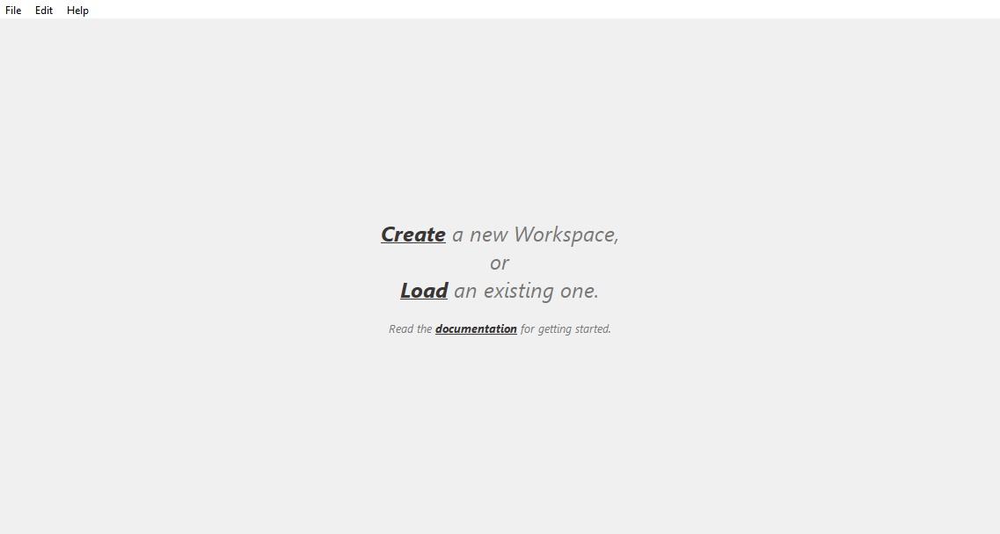
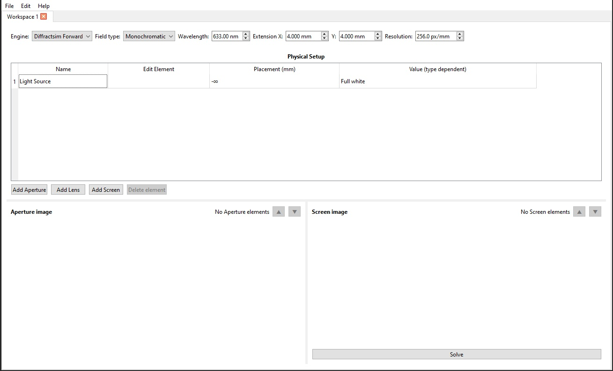

# DOESim Github Repo

## Installation

### Executable
Standalone executable files can be found under the releases page. Currently only windows versions. Simply download and open the app.

### Source
Building the source requires `Python3` and the installation of an external package called [diffractsim](https://github.com/rafael-fuente/diffractsim). Place the folder inside DOEsim master folder, or import / install it with pip. Make sure to install all requirements for it as well. These can be found in `.\diffractsim-main\requirements.txt`. The project can be started with the `main.py` script.

## The Goal

This is a project which aims to produce an **intuitive, easy to use** playground for **diffractive** and **holographic systems**. Built on the backbone of **[diffractsim](https://github.com/rafael-fuente/diffractsim)**, the amazing work of **Rafael Fuente**. By giving his python script a modern(ish) Graphical interface, I aim to lower the entry level into analysis of diffractive optical phenomena.  

## The program

### About
Coded entirely in `Python`, with `Qt6` for the graphical interface, and the above mentioned **[diffractsim](https://github.com/rafael-fuente/diffractsim)** working behind the scenes. For a functional local copy, it is necessary to install all the required packages. A standalone executable is ***planned*** for future release, but my experience with portable, truly standalone `Python`-based executables is lukewarm at best.

### Usage

On first launch, DOESim shows a welcome screen. From here you can create a new workspace with a single click or load an existing one. There is also a link to the project's GitHub page.

  

At the top of the window there is a menu bar with three main menus: **File**, **Edit**
and **Help**. These are always available:

- **File → New Workspace** – create a new workspace
- **File → Save Workspace** – save the current workspace
- **File → Load Workspace** – load a previously saved workspace
- **Edit → Preferences** – change application preferences and behaviour
- **Help → Help** – opens a browser window to the project's GitHub page
- **Help → About** – show information about the program

### Workspace and elements

After creating a new, empty workspace, the first step is to choose the **engine type**
(the **Engine** dropdown):

  

- for forward simulation: **Diffractsim Forward**
- for DOE generation / phase retrieval: **Diffractsim Reverse**

This choice cannot be changed within the same workspace once elements have been added.

Depending on the selected engine, the following element types are available:

- **Forward**: `Aperture`, `Lens`, `Screen`
- **Reverse**: `Aperture Result`, `Target Intensity`

In the top panel you can set the global system parameters (wavelength, extent –
**Extent X/Y** – and resolution). The extent applies both to the observation plane and
to the physical size of the elements.

Each element appears as a row in the **Physical Setup** table. The **Edit** button next to
the name opens a dialog to change that element's detailed properties. Frequently modified
parameters have their own columns for quicker access.

The **distance** of an element is an absolute position measured from a reference origin
plane. The order of elements is determined by this distance: to swap two elements you
must move one of them past the other in distance.

### Element types

  

-  **Aperture** – arbitrary aperture shape defined by an image file. To choose the image, click the `...` button in the last column.
  - amplitude mask: the pixel brightness controls transmission (white ≈ transparent)
  - phase mask: for grayscale images the brightness, for color images the hue determines the phase shift.
-  **Lens** – thin lens that focuses the incoming wavefront to a given focal point. The only tunable parameter is the focal length. *Please note that geometrically impossible lenses cause incorrect behaviour.*
-  **Screen** – observation plane where the intensity pattern of the incoming wavefront is recorded. To create an animation along the optical axis, enable the **Range of screens** option. Two extra parameters become available:
  - **Range end** – end of the range as an absolute position
  - **Step** – how many planes the given spatial range is divided into.

  Right‑click on a displayed result to open a context menu for saving the image or
  animation.

-  **Aperture Result** – in reverse (phase retrieval) mode this replaces the Aperture element. Here you set the phase‑retrieval parameters (maximum iteration count, algorithm, etc.). Right‑click on the displayed result to save the image from the context menu.

-  **Target Intensity** – in reverse mode this replaces the screen and holds the desired target intensity pattern. To choose the image, click the `...` button in the last column.

 
 

# Important disclaimer

The program began in *March 2025* as a quick, local collection of command-line scripts to support my research. In *October 2025* I started expanding it for presentation at the Scientific Student Conference (**TDK**) and nominated the program for my semester project in the course *Szoftverfejlesztés MI támogatással*. Because the project will be publicly accessible, I **rewrote it from scratch** to produce a cleaner, maintainable codebase; **it includes AI-assisted code.**

 

*This repository is migrated from a private one, therefore the very early versions are not tracked.*

[//]: # (Ctrl K V brings up side-by-side preview)
